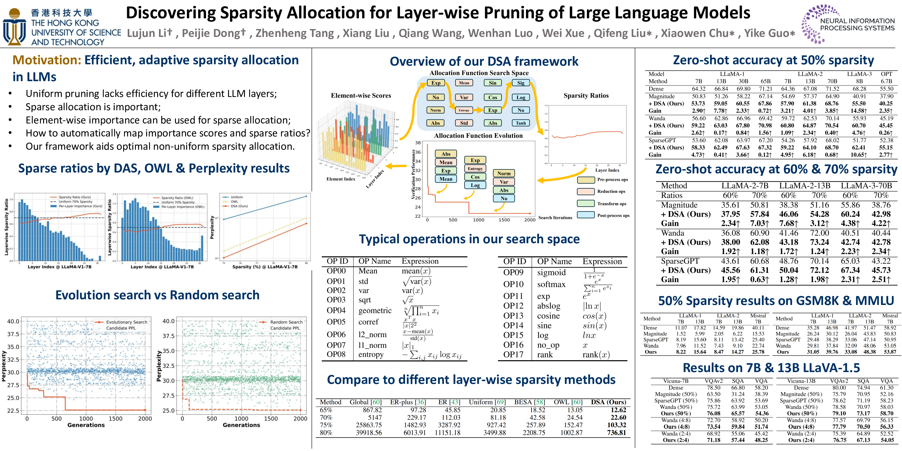

# Discovering Sparsity Allocation for Layer-wise Pruning of Large Language Models


We present DSA, the first automated framework for discovering sparsity allocation schemes for layer-wise pruning in Large Language Models (LLMs).  Our allocation functions involve two steps: reducing element-wise metrics to per-layer importance scores, and modelling layer importance to sparsity ratios. To search for the most effective allocation function, we construct a search space consisting of pre-process, reduction, transform, and post-process operations. We leverage an evolutionary algorithm to perform crossover and mutation on superior candidates within the population, guided by performance evaluation. Finally, we seamlessly integrate our discovered functions into various uniform methods, resulting in significant performance improvements. We conduct extensive experiments on multiple challenging tasks such as arithmetic, knowledge reasoning, and multimodal benchmarks spanning GSM8K, MMLU, SQA, and VQA, demonstrating that our DSA method achieves significant performance gains.



## Installation

Step 1: Create a new conda environment:

```
conda create -n prune_llm python=3.9
conda activate prune_llm
```

Step 2: Install relevant packages

```
conda install pytorch==1.10.1 torchvision==0.11.2 torchaudio==0.10.1 cudatoolkit=11.3 -c pytorch -c conda-forge
pip install transformers==4.28.0 datasets==2.11.0 wandb sentencepiece
pip install accelerate==0.18.0
```

## DSA

```
MODEL_PATH="/path/to/llama-1-7b"
CUDA_VISIBLE_DEVICES=1 python main.py \
    --model "$MODEL_PATH" \
    --model_name_or_path "$MODEL_PATH" \
    --prune_method wanda_owl_search \
    --graph_string "W:(ABSLOG)-(VAR)-(ATAN,ASIN)-(7)" \
    --sparsity_ratio 0.7 \
    --sparsity_type unstructured \
    --save save_test \
    --dataset_name c4 > "sparity_ratio_0.8_searchedresult-llama1-7b_W:(ABSLOG)-(VAR)-(ATAN,ASIN)-(7).log" 2>&1 &
```

### Acknowledgement

This repository is build upon the [Wanda](https://github.com/locuslab/wanda) ，OWL and [SparseGPT](https://github.com/IST-DASLab/sparsegpt) repositories.

## Citation

If you find DSA useful in your research, please consider citing the following paper:

```
@inproceedings{li2024dis,
  title={Discovering Sparsity Allocation for Layer-wise Pruning of Large Language Models},
  author={ Li, Lujun and Peijie and Tang, Zhenheng and Liu, Xiang  and Wang, Qiang and Luo,  Wenhan and Xue, Wei and Liu, Qifeng   and Chu, Xiaowen and Guo,  Yike},
  booktitle={NeuIPS},
    year={2024}
}
```

## License

This project is licensed under the [MIT License](LICENSE).
